## Welcome

**Hey! ^^**

My name is **Skye**, and I'm a self-taught programmer transgirl and an artist who loves to learn new stuff and improve my skills.

Right now, I'm putting my time into a Discord Bot named **[SkyeTheBot](https://skyethebot.xyz/)** (currently dead), and some other fun projects.

Don't forget to check my work and socials below and in the navigation menu. (｡・//ε//・｡)

> If you really like what I do, you can also support me by **[buying me a pizza 🍕](https://buymeacoffee.com/skyethedoggy)**

## Socials

A list with my socials.

- </img> [Revolt Server](https://rvlt.gg/j4b6N4kk)
- </img> [Discord Server](https://discord.skyedoggy.dev)
- </img> [BlueSky](https://bsky.skyedoggy.dev)
- </img> [GitHub](https://github.com/SkyeTheDoggy)
- </img> [YouTube](https://www.youtube.com/@SkyeTheDoggy)
- </img> [Pronouns.page](https://en.pronouns.page/@skyethedoggy)

## Tools and Languages

A list of tools and programming languages where I have basic knowledge and skills.

  
Tools

  <ul class="detailsContent">
    <li> VSCode</li>
    <li> NodeJS</li>
    <li> Preact</li>
    <li> React</li>
    <li> Vite</li>
  </ul>

  
Languages

  <ul class="detailsContent">
    <li> JavaScript</li>
    <li> TypeScript</li>
    <li> Python</li>
    <li> Lua</li>
  </ul>

  
Databases

  <ul class="detailsContent">
    <li> SQLite</li>
    <li> MySQL</li>
    <li> PostgreSQL</li>
  </ul>

